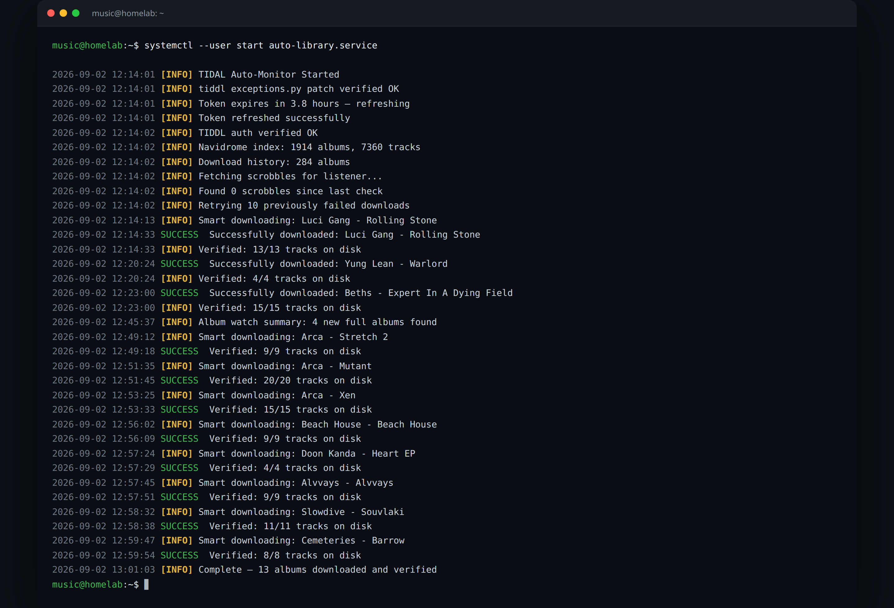

# Auto Library

**An autonomous, listening-driven music library.** Six systemd automations grow
and maintain a personal FLAC library (~1,900 albums, ~7,700 tracks) from what is
actually listened to — no manual downloading, no manual upkeep.

The system watches Last.fm scrobbles and downloads the albums that earn it
(3 plays), pulls weekly discovery from top and similar artists, builds two
playlists on its own (one from Pitchfork's RSS), backfills lyrics nightly, and
keeps the library clean with audio-fingerprint dedup. Everything runs unattended
on a home server as user-level systemd timers, and recovers by itself from the
things that actually go wrong (unplugged drives, dead API tokens, upstream
bugs).

**Who it's for:** you already run [Navidrome](https://www.navidrome.org) and
scrobble to Last.fm — this is the missing piece that fills the library from
what you actually listen to.

A real run from the homelab — environment checks, a retry of yesterday's
failures, then the weekly album-watch sweep (13 albums, each verified on disk
before being recorded):



```
Last.fm scrobbles ─► monitor.py ─► smart_download.py ─► tiddl ─► FLAC library ─► Navidrome
Last.fm top/similar ► discovery_recommendations.py ──┘                        │
Pitchfork RSS ──────► pitchfork_selects.py ─────────┘           playlists ◄───┤
Last.fm similar ────► weekly_playlist.py (library only) ─────── playlist ◄────┤
LRCLIB ─────────────► fetch_lyrics.py (.lrc sidecars) ────────────────────────┤
fpcalc ─────────────► dedup_tool.py scan (findings only, never deletes)       │
                    shared core: musiclib.py — config, logs, ntfy, Subsonic,
                    drive guard, Tidal token refresh
                    state: database/monitor.db (SQLite, WAL)   alerts: ntfy
```

Everything runs as **user-level systemd timers** (no sudo). Unit files are in
`systemd/` and symlinked into `~/.config/systemd/user/` by `systemd/install.sh`.

## What runs

| Timer | When | Script | Does |
|---|---|---|---|
| `auto-library` | every 6 h (00:10 06:10 12:10 18:10) | `monitor.py` | Last.fm scrobbles → any track played 3× gets its album downloaded. Retries failures, watches singles for full albums, alerts on auth problems. |
| `discovery` | Sun 06:00 | `automations/discovery_recommendations.py` | Up to 10 albums/week from your 7-day top artists and Last.fm "similar artists". |
| `recommendations` | Sun 07:00 | `automations/weekly_playlist.py` | Navidrome playlist **Weekly Discoveries**: 25 unplayed tracks by artists similar to what you played this week. |
| `pitchfork-selects` | daily 07:30 | `automations/pitchfork_selects.py` | Finds the week's *Pitchfork Selects* article (RSS), downloads missing albums, builds playlist **Pitchfork Selects YYYY-MM-DD**. Each article is processed once. |
| `lyrics` | daily 03:00 | `automations/fetch_lyrics.py` | Fetches `.lrc` sidecars from LRCLIB for tracks without lyrics, newest first (400/run). Remembers misses. |
| `dedup-scan` | Mon 04:00 | `dedup_tool.py scan` | Fingerprints the library (`fpcalc`) and records audio-identical duplicates for review. Never deletes anything by itself. |

All scripts share `musiclib.py` (config, rotating logs, ntfy, Subsonic API with
token auth, Navidrome DB access, Tidal token refresh, and the **music-drive
guard**: every automation aborts loudly if the library drive is not mounted or
readable instead of downloading into a dead mount).

## Built for the real world

- **Success is verified, not assumed.** `tiddl` exits 0 even when nothing was
  written (e.g. drive offline) — every downloader counts files on disk before
  recording a success.
- **The library drive is sometimes unplugged.** Automations detect that, skip
  the run *without advancing their last-checked timestamp*, and send one ntfy
  alert per 6 h. Nothing is missed; everything resumes when it is plugged back
  in.
- **Upstream bugs are detected, not suffered.** `tiddl`'s `exceptions.py` needs
  a local `**kwargs` patch (upstream #351); `monitor.py` verifies it every run
  and alerts if a pipx upgrade removed it.
- **Names don't match across services.** Tidal titles differ from Last.fm's
  (singles, deluxe editions, casing), so folder lookups are case-insensitive
  and fall back to the matched Tidal title.
- **Duplicates are classified, not deleted.** An audio-identical pair is not
  automatically waste — see the classification table below.
- **State survives everything** in `database/monitor.db` (SQLite, WAL): play
  counts, downloaded albums, failed downloads and retries, album watch list,
  lyrics attempts, fingerprints and dedup findings.

## Day to day

```bash
systemctl --user list-timers                     # what runs next
journalctl --user -u auto-library -n 50         # logs (also in logs/*.log, rotated)
systemctl --user start auto-library.service     # run one now
python3 monitor.py                               # or run directly

python3 automations/discovery_recommendations.py --dry-run
python3 automations/weekly_playlist.py --dry-run
python3 automations/pitchfork_selects.py --dry-run   # add --force to redo this week
python3 automations/fetch_lyrics.py --limit 20 --dry-run

python3 dedup_tool.py report                      # pairs grouped by kind
python3 dedup_tool.py report --kind same-album    # only the ones safe to reclaim
python3 dedup_tool.py trash <id>                  # move one copy to ~/music-trash (reversible)
python3 dedup_tool.py restore <path>
python3 dedup_tool.py purge --older-than 30d --yes
```

Duplicate findings are classified, because an audio-identical pair is not
automatically waste:

| Kind | Meaning | Action |
|---|---|---|
| `same-album` | two copies of a track in one album folder, e.g. a clean and an `(Explicit)` rip | safe to trash |
| `shared-track` | the same recording on two releases by the artist, e.g. an album and its deluxe edition | keep both |
| `cross-artist` | the same recording under two artist folders | look before touching |

Only `same-album` counts toward the "reclaimable" figure in the ntfy summary.

Notifications go to ntfy topic `music` (dedup summary to `music-dedup`).

## Setup

### 1. Prerequisites

- Python 3 (system Python is fine) + `pip install -r requirements.txt`
- External tools on the PATH: `fpcalc` (Chromaprint, for dedup), `ffmpeg`,
  `docker` (Navidrome DB access), and [`tiddl`](https://github.com/oskvr37/tiddl)
  installed via `pipx install tiddl`
- A [Navidrome](https://www.navidrome.org) server with your music mounted,
  and a scrobbling client feeding your Last.fm account

### 2. API keys & credentials

Copy `.env.example` to `.env` and fill in:

| Variable | What it's for | Where to get it |
|---|---|---|
| `LASTFM_API_KEY` | Read your scrobbles, top artists, similar artists | Create a free API account at **https://www.last.fm/api/accounts/create** (instant, no review). Use the “API key” value. |
| `LASTFM_USERNAME` | Whose scrobbles to watch | Your own Last.fm username — the account your player scrobbles to. |
| `SUBSONIC_USER` / `SUBSONIC_PASS` | Playlist creation, library rescans, lyrics lookups via Navidrome's Subsonic API | The login of your **own Navidrome server** (Admin → Users). Any user with playlist permissions works. |

Optional overrides (defaults in `.env.example`): `SUBSONIC_URL`, `MUSIC_ROOT`,
`LIBRARY_MOUNT`, `NTFY_URL`, `TIDDL_BINARY`, `TIDDL_PYTHON`, `TIDDL_CONFIG`.

**Tidal access** needs no key in `.env`: run `tiddl auth login` once and complete
the browser login. The token is stored in `~/tiddl.json` and refreshed
automatically by the automations. **Notifications** need no key either — any
[ntfy](https://ntfy.sh) topic URL works (self-hosted or ntfy.sh).

### 3. Install & verify

```bash
./systemd/install.sh      # symlinks user units + timers, enables them
python3 -m pytest tests   # 74 tests; no network needed except one Tidal auth check
systemctl --user list-timers
```

Then play a track 3 times and watch `journalctl --user -u auto-library` — or
just run `python3 monitor.py` once by hand.

## Tests

`tests/` covers the fragile parts: album-edition ranking, dedup classification
and scan logic, the monitor's tiddl patch check, Pitchfork article matching
(collaborations, punctuation variants), and a smoke test per automation. The
suite never sends notifications.

## License

[MIT](LICENSE)
